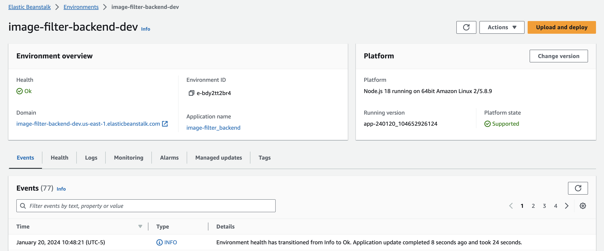

## An Image Filter Microservice on AWS

You have been hired as a software engineer to develop an application that will help the FBI find missing people.  The application will upload images to the FBI cloud database hosted in AWS. This will allow the FBI to run facial recognition software on the images to detect a match. You will be developing a NodeJS server and deploying it on AWS Elastic Beanstalk. 
You will build upon the application we've developed during the lessons in this course. You'll complete a REST API endpoint in a backend service that processes incoming image URLs.

## Getting Started Locally

You can clone this repo to run the project locally.

+ Navigate to the "./backend" directory
+ Run `$ npm run dev`
+ Server runs at [http://localhost:8082](http://localhost:8082)

## Making curl Requests

You can use REST endpoint, "/filteredImage" locally

`$ curl --location 'http://localhost:8082/filteredImage?image_url=https://upload.wikimedia.org/wikipedia/commons/thumb/b/b6/Felis_catus-cat_on_snow.jpg/2880px-F'`

This will process the image at the url you provide and return the processed image in your browser.

Additionally, you can review the returned headers to see the response code (ie 201, 422, 500) using curl's -I flag:

`curl -I --location 'http://localhost:8082/filteredImage?image_url=https://upload.wikimedia.org/wikipedia/commons/thumb/b/b6/Felis_catus-cat_on_snow.jpg/2880px-F'`

## Elastic Beanstalk deployment

This project was deployed to AWS using the Elastic Beanstalk SDK.

It will temporarily be found at [http://image-filter-backend-dev.us-east-1.elasticbeanstalk.com/](http://image-filter-backend-dev.us-east-1.elasticbeanstalk.com/)

## Remote curl requests

You can curl the REST endpoint, "/filteredImage" locally

`$ curl --location 'http://image-filter-backend-dev.us-east-1.elasticbeanstalk.com/filteredImage?image_url=https://upload.wikimedia.org/wikipedia/commons/thumb/b/b6/Felis_catus-cat_on_snow.jpg/2880px-F'`

This will process the image at the url you provide and save to your /tmp directory on the server filesystem.

## RDS & S3

Additional work has been done outside the scope of this project to connect a PostGreSQL database and S3 Bucket to allow for additional REST endpoints.

## Endpoints

### /filteredImage

`$ curl --location 'http://image-filter-backend-dev.us-east-1.elasticbeanstalk.com/filteredImage?image_url=https://upload.wikimedia.org/wikipedia/commons/thumb/b/b6/Felis_catus-cat_on_snow.jpg/2880px-F'`

This endpoint takes a url as a query parameter and processes an image.

**Query Parameters**
+ image_url

**Response**
+ Location of image

### /getImages

`$ curl --location 'http://image-filter-backend-dev.us-east-1.elasticbeanstalk.com/getImages'`

This endpoint returns all images saved in the database and and provides the S3 URL for the resource.

**Optional Query Parameter**
+ user

`$ curl --location 'http://image-filter-backend-dev.us-east-1.elasticbeanstalk.com/getImages?user=Joe'`

Using the optional parameter, one can return only images saved to the database by a specific user (ie Joe, Jenny, or Michael)